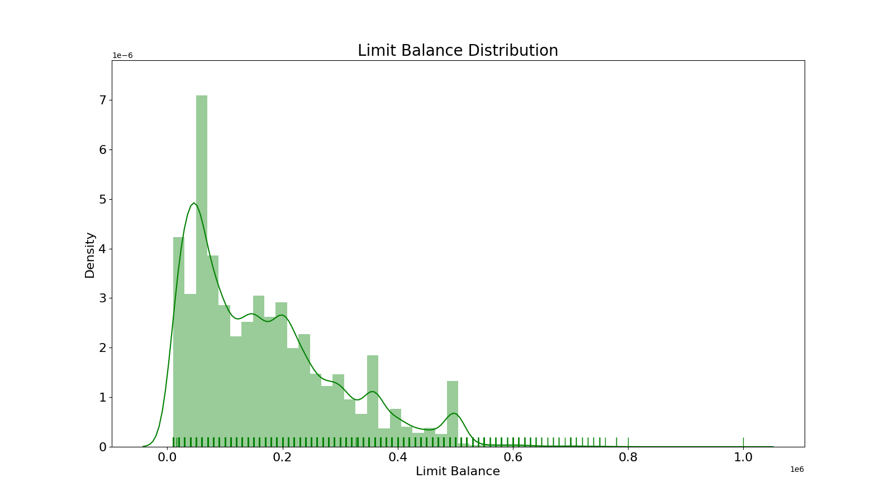

# Introduction

Amidst growing financial insecurity during the pandemic, unsecured debt has continued to rise (@Frech2021). Consequently, the consumer credit market and risk prediction has been a matter of great speculation and fear, lest there be a repeat of the financial crises that rocked the economic world in the late 2000s: In 2006, Taiwan was rocked by a credit card debt crisis with debt from credit cards and cash cards reaching $268 billion USD and over half a million people unable to repay their loans (@Yeh2009). As many could barely afford to pay the minimum credit card debt balance every month or continued to default on their payments, significant societal problems consequently plagued the country, many banks incurred heavy losses and the government eventually needed to step in to stabilize the financial system (@Yeh2009). This situation arose because many banks in Taiwan had lowered the requirements for credit card approval in order to gain more customers within the increasingly competitive industry (@Tsai2010). Such examples indicate that a strict assessment of an applicant’s capability to make their card payment is critical to a well-developed financial system and a business’s survivability in the banking industry.

This project focuses on the case of customers default payments in Taiwan and finds the predictive accuracy of the probability of the customers to default. The purpose of this study is to assess the true probability of default because the real probability of default is unknown.

## Dataset Information

This project used the data @default_credit_card from UCI Machine learning repository. As the response variable, this project used data from a binary variable, `default payment` (Yes = 1, No = 0). The following 23 factors were considered as explanatory variables in this study, which was based on a review of the literature:

`Amount of the given credit` (NT dollar): it includes both the individual consumer credit and his/her family (supplementary) credit.
`Gender` (1 = male; 2 = female).
`Education` (1 = graduate school; 2 = university; 3 = high school; 4 = others).
`Marital status` (1 = married; 2 = single; 3 = others).
`Age` (year).
`History of past payment`. The measurement scale for the repayment status is: -1 = pay duly; 1 = payment delay for one month; 2 = payment delay for two months . . . 8 = payment delay for eight months; 9 = payment delay for nine months and above.
`Amount of bill statement` (NT dollar).
`Amount of previous payment` (NT dollar).

The objective of this project is to maintain ease of interpretation for the average reader. In line with this goal, we will simplify the models and methods of analysis we choose to use as well as exclude some features in the data set in favor of greater readability.

# Methods and Results

### Exploratory Data Analysis

First, we load and tidy the data. The dataset was split into a 80% training and 20% testing set. The model will be built using only the training data. This gives the abilithy to compute a final performance metric for our model by evaluating it on the testing data. train_test_split() function shuffles the data to ensure the data ending up in the training and test sets is randomized.

```{r setup, include=FALSE}
import os

%matplotlib inline
import sys

import matplotlib.pyplot as plt
import numpy as np
import pandas as pd
import seaborn as sns
import xgboost as xgb
from sklearn.compose import ColumnTransformer, make_column_transformer
from sklearn.dummy import DummyClassifier
from sklearn.ensemble import RandomForestClassifier
from sklearn.impute import SimpleImputer
from sklearn.linear_model import LogisticRegression
from sklearn.metrics import (
    classification_report,
    confusion_matrix,
    f1_score,
    make_scorer,
    plot_confusion_matrix,
)
from sklearn.model_selection import (
    GridSearchCV,
    RandomizedSearchCV,
    cross_val_score,
    cross_validate,
    train_test_split,
)
from sklearn.pipeline import Pipeline, make_pipeline
from sklearn.preprocessing import OneHotEncoder, OrdinalEncoder, StandardScaler
from sklearn.svm import SVC
import random
import plotly.express as px
import plotly.figure_factory as ff


from src import preprocess as pp
from src import summary_stats_function as ss
from src import metrics_function as cm
from src import function_count_plot as cp
```

```{r load-data, echo = FALSE, warning = FALSE, message = FALSE}
df = pd.read_excel("https://archive.ics.uci.edu/ml/machine-learning-databases/00350/default%20of%20credit%20card%20clients.xls", skiprows=1)

df.rename(columns = {"default payment next month":"default_payment"}, inplace = True)

train_df, test_df = pp.preprocess(df, 0.8, 200)

# split into training and testing set for x and y
X_train, y_train = (train_df.drop(columns=["default_payment"]),
                   train_df["default_payment"])

X_test, y_test = (test_df.drop(columns=["default_payment"]),
                  test_df["default_payment"])
```

First we have a look at our dataset:

```{r default_credit_card, echo=FALSE, message=FALSE, out.width="80%"}
knitr::kable(head(df), caption = "Default Credit Card Dataset")
``` 

Before any data analysis can be done let's check if the dataset has null/missing values that may affect further analysis:

```{r clean-data, message=FALSE, warning=FALSE}
data_set <- df.isnull().sum()
knitr::kable(data_set)
```
Great! The dataset is super clean, and no missing value is found.

### Statistics information

This part we have a look at some basic statistics of the training set:

````{r attribute box, echo=FALSE, fig.dim = c(8, 6), fig.cap="Summary Stats."}
summary_stats <- read_csv("../results/summary_stats.csv")
knitr::kable(summary_stats)
````

We can see the following information:

* The average amount of given credit in NT dollars is 166849.320000;
* The average age of all clients is 35.419625, etc.

To better understand the correlation between variables, we would like to compute and visualize the correlations:

```{r heat-map, echo=FALSE, fig.dim = c(8, 6), fig.cap="Figure 1: Heat Map"}

```

The heatmap shows some positive/negative correlations:

Positive correlations:

* `Default payment` - `PAY_0` to `PAY_6` (Repayment status from April to September, 2005);
* `Limit balance` - `BILL_AMT1` to `BILL_AMT6` (Amount of bill statement from April to September, 2005), etc.

Negative correlations:

* `Limit balance` - `PAY_0` to `PAY_6` (Repayment status from April to September, 2005), etc.

Specifically, `PAY_0` has the highest correlation with `default_payment`. This will give us a signal that `PAY_0` plays an important role for predicting `default_payment`.

## Exploring variables

### LIMIT_BAL

First, we look at the amount of given credit (in NT dollars). Credit card limits are likely an indictor of how wealthy someone is since banks tend to give higher limits to clients that have more money with them. Thus, this may be an important feature when predicting if someone is able to pay the bill on time.

```{r limit-dist, echo=FALSE, fig.dim = c(8, 6), fig.cap="Figure 2: Limit Balance Distribution"}

```

### Repayment Status

```{r repayment_status_PAY_0, echo=FALSE, fig.dim = c(8, 6), fig.cap="Figure 3: Repayment Status PAY_0"}

```

```{r repayment_status_PAY_2, echo=FALSE, fig.dim = c(8, 6), fig.cap="Figure 4: Repayment Status PAY_2"}

```

```{r repayment_status_PAY_3, echo=FALSE, fig.dim = c(8, 6), fig.cap="Figure 5: Repayment Status PAY_3"}

```

```{r repayment_status_PAY_4, echo=FALSE, fig.dim = c(8, 6), fig.cap="Figure 6: Repayment Status PAY_4"}

```

```{r repayment_status_PAY_5, echo=FALSE, fig.dim = c(8, 6), fig.cap="Figure 7: Repayment Status PAY_5"}

```

```{r repayment_status_PAY_6, echo=FALSE, fig.dim = c(8, 6), fig.cap="Figure 8: Repayment Status PAY_6"}

```

Looking at the above plots on repayment status shows that if a client defaults on their payment for 2 months (e.g PAY_X = 2), it is a indicator to predict that default_payment = 1. It looks like repayment status will be an important feature in the model.

## Analysis

### Class Imbalance

```{r class-imbalance, echo=FALSE, fig.dim = c(8, 6), fig.cap="Figure 8: Count Plot"}

```
The above plot shows the percentage of rows with default payment = 0 versus default payment = 1. Cleary there is class imbalance in this dataset. Because of this, we will use the area under the Receiver Operating Characterisitc curve (ROC AUC) as our primary metric to evaluate our model instead of accuracy, which tends to be missleading in cases of class imbalance. ROC AUC evalauates how good the model is as distinguishing between classes, and gives a more accurate sense of how well our model generalizes when dealing with class imbalance.


# Discussion

Looking at the results above, the analysis has a few limitations. One of the main limitations is the extrapolation of data. The dataset used was from Taiwan so the model may not apply properly for financial institutions and people outside of Taiwan. The other limitation is that logistic regression favors interpretability over prediction accuracy. The coefficients are easy to understand while the logistic regression is not as accurate as other algorithms.

Another limitation of the analysis is that logistic regression is a higher bias model than other classifiers such as ensemble trees. This means that the model pays less attention to the training data and may oversimplify it, resulting in less accuracy. However, the results show that the model did very well when predicting clients who did not default next month (class 0). The high recall and precision score for class 0 suggest this model can be very useful when trying to distinguish if a client will pay the bill on time. Thus, this model can be used to help financial institutions make various risk decisions about a client including whether to offer someone a loan or whether to raise the credit card monthly limit. A prediction probability can be calculated based on the input features of each individual client. A prediction probability close to 0 indicates that the client is likely to pay the credit card bill.

According to the model, the most important feature was repayment status. Specifically, whether or not someone delayed payment for 2 months, and whether or not someone used a revolving credit card. This provides insight into what features financial institutions should look for when assessing risk for individual clients. Also, the model suggests that giving someone a revolving credit card where they only have to pay a minimum balance instead of the whole bill each month reduces the probability of the client defaulting. This information could be used to prevent the institute from losing money due to people defaulting.

Overall, the model provides insight into important features that may benefit financial institutions when managing risk, and allows an institute to calculate the probability that an individual client will default.

# References